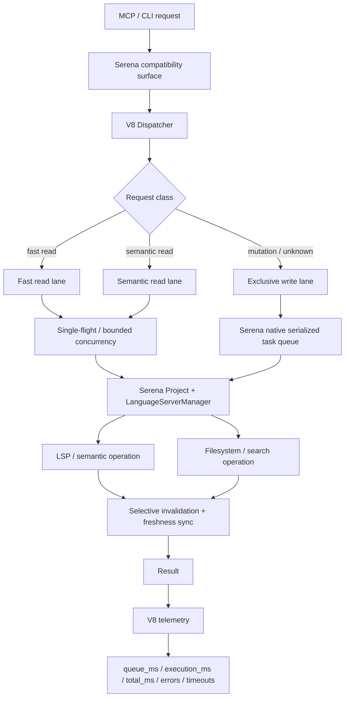

# Serena V8 Turbo

> **A performance and stability fork of Serena, rebuilt for fast MCP coding workflows, predictable installs, and production-grade semantic editing.**

[](https://github.com/elysiacores/Serena-V8-Turbo)
[](https://www.python.org/)
[](https://modelcontextprotocol.io/)
[](./tests)


Serena V8 Turbo starts from [Serena](https://github.com/oraios/serena) and pushes the runtime in a different direction: lower latency, safer edits, deterministic packaging, bounded concurrency, measurable performance, and fewer “works on my machine” surprises.

It keeps the Serena CLI, MCP protocol, semantic tooling model, and project workflow familiar. The difference is underneath.

**V8 is not a wrapper around Serena. It is a replacement fork of the `serena-agent` distribution.**

---

## Why V8 exists

Semantic coding agents are only useful when the runtime stays correct under real editing pressure.

The painful failures are rarely glamorous:

- an LSP still sees the old file after an edit;
- a stale symbol location makes a rename touch the wrong line;
- two Python distributions both believe they own `serena/`;
- a reinstall silently restores upstream files over a custom runtime;
- identical reads waste work while writes race with reads;
- a large workspace gets hashed or rescanned on every query;
- a benchmark measures the wrong executable and reports a beautiful lie;
- a tunnel restarts forever when the actual problem is authorization.

Serena V8 is an attempt to solve those operational problems **inside the runtime**, not with a pile of deployment folklore around it.

---

## The short version

| Area | Serena V8 Turbo |
|---|---|
| Distribution | Drop-in replacement named `serena-agent` — one owner for `serena/` |
| MCP compatibility | Same Serena MCP surface and CLI model |
| Runtime hot path | Central V8 dispatcher for scheduling + latency telemetry |
| Concurrency | Bounded read lanes, single-flight reads, serialized mutations |
| Edit safety | Cache invalidation + native LSP filesystem sync after mutations |
| External edits | Fast POSIX metadata freshness detection; strict hash mode available |
| Startup | Native LSP manager ready before MCP; deeper semantic prewarm is opt-in |
| Benchmarks | Real stdio MCP, executable identity verification, P50/P95/P99 + RSS |
| Release quality | Regression tests, clean-wheel install smoke, migration smoke, performance gate |
| Diagnostics | `serena-v8-doctor` verifies distribution/runtime/executable identity |

---

## Measured performance

Final clean-wheel validation on this repository, **2026-09-19**, using real stdio MCP calls:

| Workload | Warm P95 |
|---|---:|
| `list_dir` | **5.343 ms** |
| `find_symbol` | **5.167 ms** |
| Symbol overview | **6.404 ms** |
| `find_referencing_symbols` | **26.687 ms** |
| `search_for_pattern` | **87.914 ms** |

Additional observations from the same validation:

- MCP startup: **2.8–3.1 s**
- Maximum observed process-tree RSS: **278.332 MB**
- 2,000-file steady-state freshness poll P95: **7.412 ms**
- Same-size edit with restored mtime: **detected correctly**
- Regression suite: **73/73 passed**
- Live Serena tools: **36/36**
- Clean-wheel functional MCP smoke: **passed**
- Serena 1.7 → V8 → upstream rollback → V8 reinstall: **passed**

These are local measurements, not universal guarantees. Workspace size, language servers, filesystem behavior, CPU, and dependency caches all matter.

### Fast-ready vs semantic-prewarm

V8 defaults to **fast-ready** startup. Serena's native `LanguageServerManager` is available before MCP readiness, but V8 does not force an extra deep semantic probe.

That keeps startup lower and lightweight symbol operations fast. A cold references query may pay a one-time deeper LSP warmup cost.

For reference-heavy sessions:

```bash
export SERENA_V8_SEMANTIC_PREWARM=1
```

This intentionally moves that cost into startup.

---

## Architecture



The important boundary is deliberate:

- **Serena remains the compatibility surface.**
- **V8 owns runtime policy.**
- **Serena's native project and LSP lifecycle remain authoritative.**

Experimental V8 index/daemon/cache components exist, but they are not silently substituted for Serena's production semantic authority.

---

## What V8 changes

### 1. Deterministic installation instead of package roulette

Older overlay-style installations could leave two distributions claiming the same files:

```text
serena-agent metadata ─┐
                      ├── owns serena/*
serena-v8 metadata ───┘
```

Uninstall either one and the other could break.

V8 now ships as the **`serena-agent` distribution itself**. There is one package-manager owner for `serena/`.

That means fresh install, upgrade, rollback, and reinstall become normal package replacement operations instead of manual surgery inside `site-packages`.

---

### 2. One release identity

The release version is sourced from:

```text
src/serena_v8/_version.py
```

The wheel metadata, `serena.__version__`, `serena_v8.__version__`, runtime identity, CLI, doctor, and benchmarks are expected to agree.

Current release:

```text
Serena 8.0.0a1
```

No more “package manager says 1.7 but the files are secretly V8”.

---

### 3. Central request dispatcher

Tool execution now flows through a central V8 dispatcher instead of scattering scheduling and metrics logic around the compatibility layer.

The dispatcher tracks:

```text
request
  → scheduler admission
  → queue
  → execution
  → completion
  → telemetry
```

Telemetry records include:

- `queue_ms`
- `execution_ms`
- `total_ms`
- scheduler lane
- request ID
- deduplication state
- timeout/error state

The goal is simple: **optimize from measurements, not vibes**.

---

### 4. Bounded concurrency with write safety

V8 uses separate scheduler lanes:

```text
FAST_READ
SEMANTIC_READ
WRITE_REFACTOR
```

Behavior:

- known reads can run concurrently;
- identical in-flight reads can use single-flight deduplication;
- writes are never deduplicated;
- mutations are exclusive against reads;
- unknown tools default to the safe mutation lane;
- queues are bounded;
- deadlines and backpressure are explicit.

A running mutation is not reported as “timed out and cancelled” while its worker is still changing files. Python cannot safely kill that thread, so V8 waits for a definitive mutation result once execution has begun.

Correctness wins over fake timeout semantics.

---

### 5. Native Serena write serialization is preserved

V8 does **not** bypass Serena's native task ordering for mutations.

Write/refactor operations still pass through Serena's native serialized task queue, keeping them ordered with project and language-server lifecycle work.

Reads can take the faster V8 path. Mutations remain conservative.

---

### 6. LSP freshness after edits

A semantic engine is dangerous when the file on disk and the language server disagree.

V8's live edit path is designed around:

```text
edit
  → invalidate affected semantic/cache state
  → synchronize Serena's active LanguageServerManager
  → allow the next semantic query
```

V8 does not load a second project just to notify an LSP and does not create a competing language-server authority.

---

### 7. Fast external-edit detection

The naive correctness fix is to hash every source file before every semantic request.

It works.

It is also expensive.

V8 uses a faster default on POSIX filesystems:

```text
mtime_ns + ctime_ns + size
```

`ctime_ns` changes when file contents are rewritten even when a tool restores the previous mtime, allowing V8 to catch preserved-mtime edits without reading every file.

For unusual filesystems:

```bash
# Hash every tracked source file.
export SERENA_V8_STRICT_FRESHNESS_HASH=1

# Or enable a temporary hash window in milliseconds.
export SERENA_V8_FRESHNESS_HASH_WINDOW_MS=2000
```

Windows defaults to the stricter content-hash path because ctime semantics differ.

---

### 8. Safer filesystem discovery

Large coding workspaces are full of things an agent should not recursively eat for breakfast:

- `node_modules`
- build output
- generated directories
- symlink loops
- dependency trees
- worktrees
- caches

V8 hardens source discovery around bounded traversal and safer symlink behavior while still allowing explicit project configuration to include generated sources when required.

---

### 9. Performance benchmarks that fail closed

A benchmark is useless if it accidentally launches a different `serena` from `PATH`.

V8's MCP benchmark requires:

- an explicit executable path;
- an exact expected release version;
- real MCP `initialize`;
- real `tools/call`;
- correctness assertions on returned content;
- rejection of MCP error payloads;
- process-tree RSS measurement.

It reports:

- startup latency;
- first-call latency;
- warm P50/P95/P99;
- max latency;
- Serena + recursive LSP child RSS.

Transport success alone does **not** count as a passing benchmark.

---

### 10. Release gates instead of hope

The release gate runs:

```text
regression tests
    ↓
clean-wheel install smoke
    ↓
MCP functional + semantic smoke
    ↓
performance workloads
    ↓
process-tree RSS checks
    ↓
freshness correctness/performance
    ↓
PASS / FAIL
```

Run it with:

```bash
./scripts/release-gate.sh
```

Default guardrails are intentionally broad enough for variable CI hardware while still catching catastrophic regressions.

---

## Installation

### Requirements

- Python **3.11–3.14**
- [uv](https://docs.astral.sh/uv/)

### Fresh install or upgrade

```bash
uv tool install --force git+https://github.com/elysiacores/Serena-V8-Turbo.git
```

Verify:

```bash
serena --version
serena-v8-doctor
uv tool list
```

Expected:

```text
Serena 8.0.0a1
```

### Install from a local checkout

```bash
git clone https://github.com/elysiacores/Serena-V8-Turbo.git
cd Serena-V8-Turbo

SERENA_V8_SOURCE=. ./scripts/install-v8.sh
```

### Upgrade

Run the same replacement operation:

```bash
uv tool install --force git+https://github.com/elysiacores/Serena-V8-Turbo.git
serena-v8-doctor
```

### Roll back to upstream Serena

Because V8 uses the same distribution identity, rollback is normal replacement:

```bash
uv tool install --force serena-agent
serena --version
```

To return to V8:

```bash
uv tool install --force git+https://github.com/elysiacores/Serena-V8-Turbo.git
```

> **Do not manually copy V8 files into `site-packages`. Do not install a legacy `serena-v8` distribution beside `serena-agent`.**

---

## Installation doctor

`serena-v8-doctor` checks the things that usually make Python CLI installations weird:

```bash
serena-v8-doctor
```

It verifies:

- expected release version;
- installed `serena-agent` distribution version;
- imported Serena runtime version;
- runtime path;
- Python executable;
- Serena executable in the current environment;
- whether `PATH` points at a different Serena;
- whether legacy `serena-v8` metadata is still installed.

A healthy install should agree on one identity.

---

## Starting MCP

Normal Serena usage stays normal:

```bash
serena start-mcp-server \
  --transport stdio \
  --project /absolute/path/to/project
```

The V8 runtime is behind the same CLI surface.

For production services, prefer the **absolute path returned by `command -v serena`** instead of copying a path from another host.

---

## Multi-repository workspaces

V8 supports an aggregated workspace root containing multiple repositories while keeping one isolated MCP/project identity.

Example:

```yaml
# .serena/project.yml
language_servers:
  - typescript
  - svelte
  - go

ls_workspace_folders:
  - ./frontend
  - ./backend
  - ./contracts

ignored_paths:
  - "**/.worktrees/**"
  - "**/.serena/**"
  - "**/node_modules/**"
  - "**/dist/**"
  - "**/build/**"
```

Recommended invariant:

```text
1 MCP process
= 1 active workspace root
= 1 LSP/cache/telemetry identity
```

Do not silently broaden a running workspace just because a new repository appears beneath the root.

---

## Benchmark it yourself

### One MCP workload

```bash
python benchmarks/mcp_latency_benchmark.py \
  --project "$PWD" \
  --tool find_symbol \
  --arguments '{"name_path_pattern":"SmartScheduler","relative_path":"src/serena_v8/scheduler.py"}' \
  --rounds 10 \
  --executable "$(command -v serena)" \
  --expected-version 8.0.0a1 \
  --expect-contains SmartScheduler
```

### Default workload suite

```bash
python benchmarks/performance_suite.py \
  --project "$PWD" \
  --executable "$(command -v serena)" \
  --expected-version 8.0.0a1 \
  --rounds 5
```

### Freshness benchmark

```bash
python benchmarks/freshness_poll_benchmark.py \
  --files 2000 \
  --rounds 20
```

### Performance regression gate

```bash
python benchmarks/performance_gate.py \
  --current benchmarks/results/current.json \
  --baseline benchmarks/results/baseline.json \
  --max-regression-percent 15
```

Or run the full release gate:

```bash
./scripts/release-gate.sh
```

---

## Test and development

Create the development environment:

```bash
uv sync --extra dev
```

Run tests:

```bash
uv run python -m pytest -q
```

Run the isolated installation smoke:

```bash
./scripts/smoke-install.sh
```

The CI matrix exercises Python:

```text
3.11
3.12
3.13
3.14
```

---

## Runtime knobs

| Variable | Purpose |
|---|---|
| `SERENA_V8_SEMANTIC_PREWARM=1` | Trade slower startup for a warmer first deep semantic/reference query |
| `SERENA_V8_STRICT_FRESHNESS_HASH=1` | Hash every tracked file for correctness-first freshness detection |
| `SERENA_V8_FRESHNESS_HASH_WINDOW_MS=<ms>` | Temporarily hash recently touched files on coarse filesystems |
| `SERENA_V8_CGC_DB_ROOT=<path>` | Override CGC database root for experimental sidecar/index workflows |
| `SERENA_V8_SIDECAR_TIMEOUT_MS=<ms>` | Bound supported sidecar operations |

The production semantic authority remains Serena's native `Project` + `LanguageServerManager`.

---

## What is live vs experimental

### Live in the normal MCP path

- Serena-compatible CLI and MCP tools
- V8 request dispatcher
- bounded scheduler lanes
- single-flight reads
- exclusive/serialized mutations
- queue/execution/total latency telemetry
- selective cache invalidation
- external-edit freshness detection
- native LSP synchronization
- fast-ready startup policy
- installation doctor
- clean-wheel migration and rollback path
- benchmark correctness gates
- release gate and CI

### Experimental / diagnostic

- standalone V8 daemon/socket path
- persistent symbol index experiments
- CGC sidecar/index workflows
- alternative cache/index components not wired as Serena's semantic authority

Those components are intentionally not marketed as “live” until the normal MCP path actually depends on them.

---

## Production philosophy

V8 follows a few rules:

**Correctness before cleverness.**
A 2 ms rename that edits the wrong symbol is not fast.

**One owner per stateful subsystem.**
One package owner. One active project. One authoritative LSP manager.

**Bound everything that can grow.**
Queues, caches, sidecars, history, and worker counts should have limits.

**Measure the real path.**
Benchmark the installed executable through MCP, not a convenient internal function.

**Fail loudly when identity is ambiguous.**
A doctor command is cheaper than debugging the wrong Python environment for three hours.

**Performance changes need regression gates.**
“Feels faster” is not a metric.

---

## Troubleshooting

Start here:

```bash
serena-v8-doctor
serena --version
uv tool list
```

Then see [TROUBLESHOOTING.md](./TROUBLESHOOTING.md) for migration cleanup, PATH issues, LSP startup, external-edit freshness, semantic prewarm, benchmarks, and rollback.

---

## Repository layout

```text
src/
├── serena/                 # Serena-compatible surface + live integration
├── serena_v8/
│   ├── runtime/
│   │   └── dispatcher.py   # central hot path
│   ├── scheduler.py        # bounded lanes / single-flight / exclusivity
│   ├── lsp_sync.py         # edit + LSP freshness integration
│   ├── sidecars.py         # bounded sidecar / CGC support
│   └── _version.py         # release identity source of truth
├── solidlsp/
└── interprompt/

benchmarks/                 # correctness-gated latency/RSS/freshness benchmarks
scripts/                    # installer, smoke test, release gate
tests/                      # V8 regression and safety coverage
.github/workflows/          # CI matrix + clean install smoke
```

---

## Status

**Current release: `8.0.0a1`**

The current release has been validated for:

- deterministic `serena-agent` replacement packaging;
- clean wheel installation;
- Serena 1.7 migration and rollback;
- real stdio MCP startup and tool execution;
- semantic tool execution;
- scheduler safety;
- edit/LSP freshness regressions;
- package/runtime identity consistency;
- performance and memory guardrails.

V8 is still an alpha release. The architecture is intentionally being hardened before pretending the version number is more mature than the runtime.

---

## Credits

Serena V8 Turbo is built on the excellent work of the upstream [Serena](https://github.com/oraios/serena) project and keeps its semantic coding model at the center.

This fork focuses on runtime performance, operational safety, packaging, observability, and production hardening.

---

## License

MIT, as declared in `pyproject.toml`.

---

**Repository:** https://github.com/elysiacores/Serena-V8-Turbo
